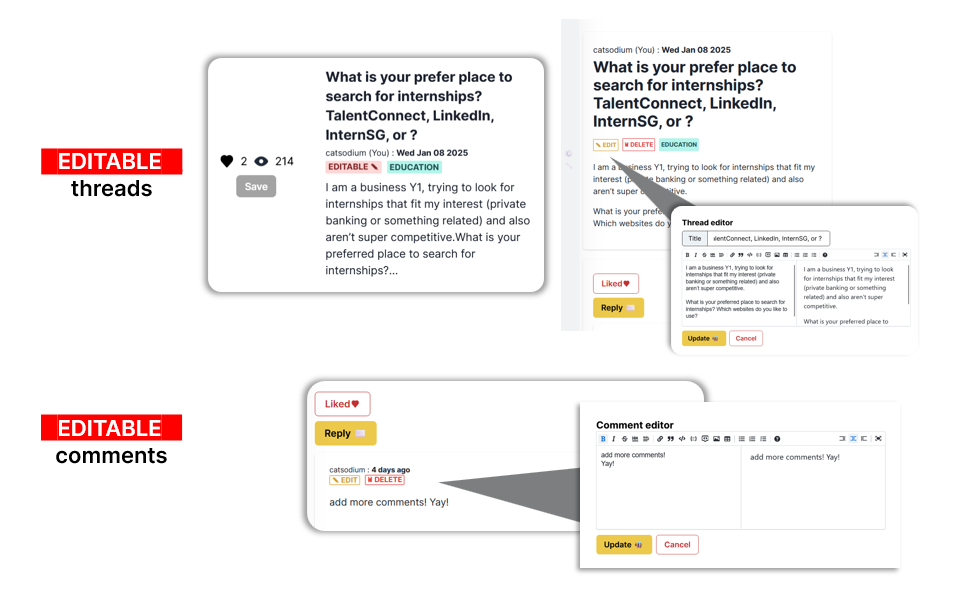

# [ThreadKeep ⬢](https://threadkeep-frontend.vercel.app) - Your personal archive for online conversations.


## About this project
**ThreadKeep** is a web forum where people can create online forums. It's designed to be easy to use, and a special feature lets users easily pull out the most important information from other people's forums. This project was developed as a part of CVWO Assignment for the School of Computing, National University of Singapore (NUS). This is the **frontend** repository. For backend repository, please visit [here](https://github.com/CATISNOTSODIUM/threadkeep-backend).


## Introduction
While most of the forum discussion platforms available today allow users can engage in conversations by posting messages, sharing information, asking questions, and interacting with others on a variety of topics, retrieving information from the thread can only be done in only one way, retrieving information from the thread can only be done in one way: manually dragging the relevant part from the post and copying it into the clipboard. For instance, for the thread about solving a coding problem, the most relevant information is the code snippet. Imagine users having to retrieve information from multiple threads; manually copying one by one can be tedious.

This project aims to solve this problem by integrating a built-in data retrieval system. Inspired by an online-shopping platform, where users click on products into their shopping carts and pay for them in a single click, this web forum allows users to filter irrelevant information from multiple threads and retrieve the information at once. 

## Tech Stack
- **Programming Language**: TypeScript
- **Third-party Libraries**: React, [dnd-kit](https://dndkit.com/) for drag and drop components,  [react-markdown-editor](https://uiwjs.github.io/react-markdown-editor/), `reduxjs/toolkit` for Redux development.
- **Styling**: Tailwind CSS, Material UI

Currently, Redux is only handling user authentication. The codebase will be expanded to use Redux more extensively when I have available time.

# Table of contents
- [ThreadKeep ⬢ - Your personal archive for online conversations.](#threadkeep----your-personal-archive-for-online-conversations)
  - [About this project](#about-this-project)
  - [Introduction](#introduction)
  - [Tech Stack](#tech-stack)
- [Table of contents](#table-of-contents)
- [Quick start](#quick-start)
  - [Building and Running the App Locally](#building-and-running-the-app-locally)
  - [Deployment](#deployment)
- [User manual](#user-manual)
  - [Account Registeration](#account-registeration)
  - [Threads Management](#threads-management)
    - [Create threads](#create-threads)
    - [Update threads](#update-threads)
    - [Saving Threads](#saving-threads)
  - [Data retrieval](#data-retrieval)
- [Future plan](#future-plan)
- [Acknowledgement](#acknowledgement)

# Quick start
In order to connect with backend, you need to configure your `.env.local` file.
By default, if you host your backend locally, your environment file should be like this.
If you have already hosted your backend, please replace `REACT_APP_BACKEND_API` with your deployed backend url.
```bash
NODE_PATH=./src
REACT_APP_BACKEND_API="http://localhost:8080"
COOKIE_EXPIRATION_DAY=7 # for JWT authentication
```
## Building and Running the App Locally
To start a local development server, make sure to install the required dependencies by running `npm install`. Then, you can start the local server by executing `npm start`.

After you have run the following commands, the development server will be hosted at port 3000 `http://localhost:3000/`. 

## Deployment
There are many deployment options we can choose. Personally, I use [Vercel](https://vercel.com) since it has free-tier and convenient to deploy. This project is deployed [here](https://threadkeep-frontend.vercel.app).
# User manual
**ThreadKeep** is designed to be easy to use, with complete CRUD operation and its ability to save threads and retrieve information from them. Here is the basic user guide.
## Account Registeration
After visiting the landing page, click on the `Sign In / Register` button to sign in or create a new account. If you're new to ThreadKeep, this web forum authenticates users based solely on their usernames. You can optionally enter a password for added security. Note that you must sign in to view other pages. After you have signed in, you will be redirected to `/threads` page.

ThreadKeep uses `JWT Token` to verify user while temporarily store user information as cookies. By default, the cookie will expire in 7 days. However, you can configure the cookie expiration date from one of the environment variables `COOKIE_EXPIRATION_DAY`.

## Threads Management
### Create threads
To create a new thread, simply click the `CREATE` button. Each thread requires a title and a description.

- **Title**: A concise and informative name for your thread.
- **Description**: A more detailed explanation of the topic or discussion you're starting. This provides context for other users. While the description text field is supported by markdown, `LaTex` has not yet been supported.
- **Optional Tags:** You can also add tags to your thread to categorize it and make it easier for others to find. Tags are optional, but they can be very helpful in organizing and discovering relevant discussions.


### Update threads
To update **your** thread, Find the thread you wish to update within the `/thread` page. Note that only thread with `Edit` icon can be modified. Then, click into the thread card you wish to edit, look for an `Edit` button and make your changes.

### Saving Threads
To save the thread, just simply click the `save` button in the `/thread` page. Your saved thread will be shown in your sidebar and your profile page.
 

## Data retrieval
Data retrieval can be accessed through your sidebar or your profile page. To toggle the sidebar, simply click on the left border of your screen. Here, you'll find the tool button and your saved threads.


By toggling the tool button, you can filter the type of information you want to retrieve. Currently, our application supports three filters: text, image, and code snippets. You can click "Preview" to check your filtered data before saving it to your device. You have the option to save the data as a markdown file `(.md)` or a text file `(.txt)`.

# Future plan
- Support multilayed comments
- Support saving comments
- Saving filtered data as PDF file `.pdf`.
- Refactor the entire application using `redux` framework


# Acknowledgement
First of all, thank you for this CVWO winter assignment. It has helped me learn essential programming concepts and become familiar with web development frameworks step by step throughout the guide

To be honest, grinding through this assignment without prior knowledge of Go, Docker, and SQL was initially daunting and mind-blocking. However, in the end, I finally did it! Thank you to all YouTube tutorial creators such as Net Ninja, Fireship, and Web Dev Simplified who provided guidance throughout this assignment. Also, thank you to the DataCamp SQL course for helping me grasp the basic ideas of working with SQL.

I would like to express special thanks to one of my year 3 CS seniors who recommended this program, and also to the NUS School of Computing for offering this opportunity. This winter break would not have been as interesting if this assignment had not existed. Even though I might not get selected for the next round, I will not be disappointed.
